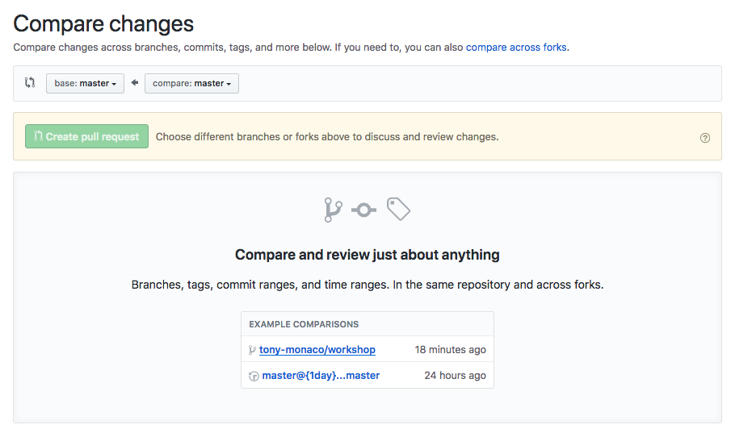

# Github-Workshop
Repo for 2018 Fall Github-Workshop
9/30/18

# Workshop Goals
The goal of this workshop is to provide a baseline familiarity with using git + GitHub. At the end of this workshop, you should be able to 
- Clone a repo
- Create a branch
- Commit changes
- Create a pull request
- Approve a pull request
- Land your changes

Essentially, the basic functionalities of a GitHub-based development pipeline.

# Instructions:
## Setup:
0. Ensure you are a colaborator on this repo! Talk to your PM if you are not, and they will add you. 

1. Clone this repo: 
`git clone https://github.com/JumboCode/GitHub-Workshop.git`

## Adding a feature:

2. Create a new branch. Label it with your name and the feature:
`git branch [first name]-[last name]/workshop`
e.g. `git branch tony-monaco/workshop`

When making branches, it's important that their names correlate directly to their new feature. In an actual repo, this might be something like `tony-monaco/header-bar-styling`

3. Ensure your branch was created by running `git branch`. This will list your branches, you should see something like:
```
$ git branch
$ * master
$ tony-monaco/workshop
```

4. Check out your branch. This ensures change you make will be added to that branch only. 
`git checkout [first name]-[last name]/workshop`

5. Ensure you are on the right branch, again by running `git branch`. a `*` will be in front of your current branch, like:
```
$ git branch
$ master
$ * tony-monaco/workshop
```

6. Add a new file to this directory! Create a new file, call it `[first name]-[last name].txt`. Put whatever you want in the body of the file.

7. Run `git status`. You should see something like:
```
On branch tony-monaco/workshop
Untracked files:
  (use "git add <file>..." to include in what will be committed)

	tony-monaco.txt

nothing added to commit but untracked files present (use "git add" to track)
```

8. Follow those git status instructios-- run `git add [file]`, e.g. `git add tony-manaco.txt`

9. Run `git status` again. This time, you should see something like this:
```
On branch tony-monaco/workshop
Changes to be committed:
  (use "git reset HEAD <file>..." to unstage)

	new file:   tony-monaco.txt
```

10. Commit the changes by running `git commit -m "[commit message]"`. Make sure you commit message is sensible! For example, `git commit -m "Added new tony monaco file"`

11. Push the branch to remote (to GitHub!). If you run `git push`, you'll recieve a message like 
```
fatal: The current branch tony-monaco/workshop has no upstream branch.
To push the current branch and set the remote as upstream, use

    git push --set-upstream origin tony-monaco/workshop
```
Becuase this branch is only local right now. So run `git push --set-upstream origin [branch name]` to set the remote destination also.

12. On Github, ensure your branch exists:


## Making a Pull Request:

13. Go to *Pull Requests* and create a new pull request:


14. Select the branch you were working on:


15. Create the Pull Request:


16. You'll be prompted for some info for your pull request:

Ensure that (at least) these are filled out: 

a. The title (in this case, the head commit)

b. A comment explaining what's going on in these changes

c. Reviewers for this Pull Request. For this workshop, have one be a member of your team and one be your PM. 

## Reviewing Pull Requests:

*Important:* Don't (try) do these for the Pull Request you just made! Do this for someone on your team that just completed step 16.

17. Go to the Pull Request page, go to the request you're reviewing:


18. On the Pull Request, find the *Add your Review* button:


19. Write a review; approve it if it looks good, or request additional changes if not. 
*For this workshop, use this to determine if it 'looks good':*
- Did they add the file with their name?
- Did they modify any other files?
- Are there unnecesary files added (e.g. system files like .DS_store)? 


## Merging Pull Requests

20. If your pull request has been accepted, merge it (when on your teams, still double check functionality first)!
Note that there are additional options for merging, e.g. *squashing*. These affect how the branch gets merged on top of the current state-- for now, just click the defaults. 


21. Confrim the merge:


22. It's merged! On your local machine, run `git checkout master` and `git pull`. Your master should now reflect the changes you made in your branch!
